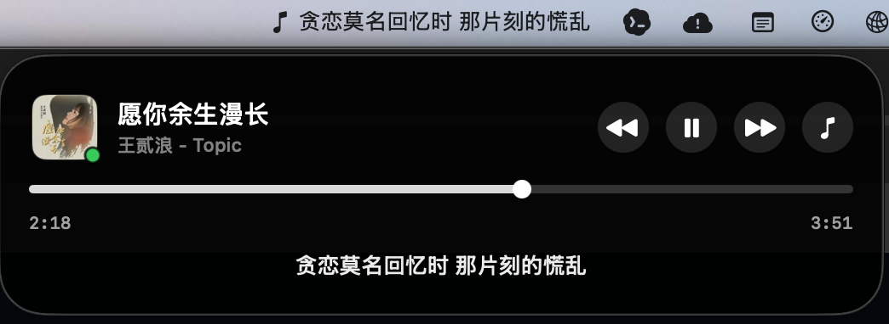

# MusicIsland

A lightweight macOS menu bar companion that brings a Dynamic Island–style now-playing experience to the desktop. MusicIsland lives quietly in your menu bar, shows the lyric line currently playing right next to its icon, and expands into a compact island with artwork, a scrubber, and playback controls when you hover over it.

It's built primarily around [NetEase Cloud Music (网易云音乐)](https://music.163.com/) — pulling time-synced lyrics from the NetEase API — but it reads now-playing state from macOS's system media controls, so it reflects whatever your Mac is currently playing.

> **Status:** early and experimental (v0.1). Contributions are very welcome — see [Contributing](#contributing).



## Download

Grab the latest `MusicIsland-<version>.dmg` from the [Releases page](https://github.com/James-Kua/MusicIsland/releases), open it, and drag **MusicIsland** into your **Applications** folder.

Because the app isn't notarized yet, macOS Gatekeeper will block it the first time. To open it, right-click **MusicIsland.app → Open**, then confirm — or run:

```bash
xattr -dr com.apple.quarantine /Applications/MusicIsland.app
```

On first launch, grant **Accessibility** access when prompted (see [Permissions](#permissions)).

## Features

- **Live lyrics in the menu bar** — the current lyric line appears beside the menu bar icon while music plays.
- **Hover-to-expand island** — hovering the icon reveals a floating island with album artwork, track info, and a seek scrubber. It stays open while your pointer is over it.
- **Playback controls** — play/pause, next, previous, and scrub-to-position.
- **Time-synced lyrics** — lyrics (with translations when available) are fetched from NetEase and advanced in time with playback.
- **System now-playing integration** — reads title, artist, album, artwork, elapsed time, and duration from macOS's private `MediaRemote` framework, with fallbacks for resilience.
- **Works with YouTube and other sources** — anything that reports to macOS's now-playing controls (e.g. YouTube in a browser) shows up in the island. Note that lyrics are matched against NetEase's catalog by title/artist, so lyric availability and timing are **not guaranteed** for non-NetEase sources.
- **Menu bar only** — runs as an agent (`LSUIElement`), so there's no Dock icon or stray window.

## Requirements

- macOS 13 (Ventura) or later
- Swift 5.9+ (Xcode command line tools)

## Getting started

The easiest way to build, bundle, code-sign, and launch the app is the helper script:

```bash
./Scripts/restart-app.sh
```

It runs `swift build`, assembles a `.app` bundle under `.build/MusicIsland.app`, code-signs it, and launches it.

To just build the binary:

```bash
swift build
```

### Testing

Run the deterministic unit tests with:

```bash
swift test
```

Lyric matching also has optional network fixtures that fetch YouTube oEmbed metadata, query NetEase search, and verify the selected NetEase title for known edge cases. These tests are skipped by default so local and CI runs do not depend on live external services. To run them explicitly:

```bash
MUSICISLAND_RUN_NETWORK_TESTS=1 swift test --filter NetEaseVideoIntegrationTests
```

### Code signing

The script signs with an Apple Development identity if one is available, and falls back to ad-hoc signing otherwise. To pick a specific identity:

```bash
MUSICISLAND_SIGNING_IDENTITY="Apple Development: you@example.com (TEAMID)" ./Scripts/restart-app.sh
```

### Building a release `.dmg`

To produce a distributable disk image (a release build, bundled, signed, and packaged with a drag-to-Applications layout):

```bash
./Scripts/build-dmg.sh
```

The result is written to `dist/MusicIsland-<version>.dmg`. The same `MUSICISLAND_SIGNING_IDENTITY` override applies. This `.dmg` is what gets attached to a GitHub release for users to download.

## Permissions

MusicIsland needs a couple of macOS permissions to work fully:

- **Accessibility** — required to post system media-key events that control playback. Grant it under **System Settings → Privacy & Security → Accessibility**. If controls don't respond, confirm MusicIsland is enabled here.
- **Now-playing access** — reading system media state relies on the private `MediaRemote` framework.

## Architecture

The app is a Swift Package with a single executable target. Source is organized one type per file under `Sources/MusicIsland/`:

```
Sources/MusicIsland/
  App/
    MusicIslandApp.swift            Entry point (@main)
    AppDelegate.swift             Wires up the status item, model, and island window
    StatusItemHoverController.swift  Hover detection for the menu bar icon
  Models/
    Track.swift                   Now-playing track value type
    LyricLine.swift               A single timed lyric line
    NowPlayingSnapshot.swift      Immutable snapshot of player state
    MusicModel.swift              Observable app state; polling + lyric syncing
  Window/
    IslandWindowController.swift  Positions and shows/hides the floating island
    IslandWindow.swift            Borderless NSWindow subclass
  Views/
    IslandView.swift              The island's SwiftUI layout
    ArtworkView.swift             Album artwork + playing indicator
    ScrubberView.swift            Seek bar with drag-to-scrub
    IslandIconControl.swift       Round control button
  NowPlaying/
    NowPlayingBridge.swift        Reads now-playing info from MediaRemote
  NetEase/
    MediaKey.swift                System media key codes
    NetEaseController.swift       Playback control (media keys + MediaRemote seek)
    NetEaseMusicClient.swift      NetEase search + lyrics HTTP client
    LyricParser.swift             Parses LRC lyrics (with translations)
  Support/
    DebugLog.swift                Simple file logger (/private/tmp/musicisland-debug.log)
    AccessibilityPermission.swift Requests Accessibility access
```

**Data flow:** `MusicModel` polls `NowPlayingBridge` once per second. The bridge reads `MRMediaRemoteGetNowPlayingInfo` from the private `MediaRemote` framework (loaded dynamically via `dlopen`), with a sub-process probe and a NetEase-specific fallback when no media info is available. When the track changes, `MusicModel` asks `NetEaseMusicClient` for lyrics, which `LyricParser` turns into timed lines that are advanced against the current playback position. Playback commands go through `NetEaseController` (system media keys, plus `MRMediaRemoteSendCommand` for seeking).

## Contributing

Issues and pull requests are welcome! Please read [CONTRIBUTING.md](CONTRIBUTING.md) for build steps and conventions.

## Caveats

MusicIsland relies on Apple's private `MediaRemote` framework and on the structure of NetEase Music's menu and API. These are undocumented and may change between macOS or app versions. This is a personal/community project and is not affiliated with Apple or NetEase.

## License

[MIT](LICENSE) © James Kua
